# Class and Method Reference

This reference documents the executable architecture (classes and exported methods) used by the reconciliation platform.

For each method, the documentation includes:

- inputs
- outputs
- state before execution
- state after execution

## Table of Contents

- [State Object Conventions](#state-object-conventions)
- [API Layer](#api-layer)
- [Core Layer](#core-layer)
- [Config Layer](#config-layer)
- [Per-Method Sequence Diagrams](#per-method-sequence-diagrams)
- [Notes for Documentation Maintenance](#notes-for-documentation-maintenance)

### API Methods

- [Class: InMemoryRunRepository](#class-inmemoryrunrepository)
- [Method: save(run)](#method-saverun)
- [Method: findById(id)](#method-findbyidid)
- [Method: executeReconciliation(input)](#method-executereconciliationinput)
- [Method: createApp(repository?)](#method-createapprepository)
- [Method: startServer()](#method-startserver)

### Core Methods

- [Method: parseWorkbook(input)](#method-parseworkbookinput)
- [Method: normalizeText(value, config)](#method-normalizetextvalue-config)
- [Method: buildComparisonTokens(values, config)](#method-buildcomparisontokensvalues-config)
- [Method: normalizeTransactions(runId, rawRows, config)](#method-normalizetransactionsrunid-rawrows-config)
- [Method: currencyEquals(left, right, tolerance)](#method-currencyequalsleft-right-tolerance)
- [Method: amountDifference(left, right)](#method-amountdifferenceleft-right)
- [Method: dateDifferenceDays(left, right)](#method-datedifferencedaysleft-right)
- [Method: tokenSimilarity(left, right)](#method-tokensimilarityleft-right)
- [Method: reconcileMatches(transactions, config)](#method-reconcilematchestransactions-config)
- [Method: classifyExceptions(input)](#method-classifyexceptionsinput)
- [Method: buildSummaryMetrics(normalizedTransactions, matchResults, exceptions)](#method-buildsummarymetricsnormalizedtransactions-matchresults-exceptions)
- [Method: buildChartSeries(summary)](#method-buildchartseriessummary)
- [Method: exportWorkbook(input)](#method-exportworkbookinput)
- [Method: runReconciliation(input)](#method-runreconciliationinput)

### Config Methods

- [Method: resolveReconciliationConfig(accountIdentifier?, overrides?)](#method-resolvereconciliationconfigaccountidentifier-overrides)

### Sequence Diagram Index

- [InMemoryRunRepository.save(run)](#inmemoryrunrepositorysaverun)
- [InMemoryRunRepository.findById(id)](#inmemoryrunrepositoryfindbyidid)
- [executeReconciliation(input)](#executereconciliationinput)
- [createApp(repository?)](#createapprepository)
- [startServer()](#startserver)
- [parseWorkbook(input)](#parseworkbookinput)
- [normalizeText(value, config)](#normalizetextvalue-config)
- [buildComparisonTokens(values, config)](#buildcomparisontokensvalues-config)
- [normalizeTransactions(runId, rawRows, config)](#normalizetransactionsrunid-rawrows-config)
- [currencyEquals(left, right, tolerance)](#currencyequalsleft-right-tolerance)
- [amountDifference(left, right)](#amountdifferenceleft-right)
- [dateDifferenceDays(left, right)](#datedifferencedaysleft-right)
- [tokenSimilarity(left, right)](#tokensimilarityleft-right)
- [reconcileMatches(transactions, config)](#reconcilematchestransactions-config)
- [classifyExceptions(input)](#classifyexceptionsinput)
- [buildSummaryMetrics(normalizedTransactions, matchResults, exceptions)](#buildsummarymetricsnormalizedtransactions-matchresults-exceptions)
- [buildChartSeries(summary)](#buildchartseriessummary)
- [exportWorkbook(input)](#exportworkbookinput)
- [runReconciliation(input)](#runreconciliationinput)
- [resolveReconciliationConfig(accountIdentifier?, overrides?)](#resolvereconciliationconfigaccountidentifier-overrides)

## State Object Conventions

[Back to TOC](#table-of-contents)

The project uses the following state model notation in this document.

```ts
interface MethodStateBefore {
  // Inputs and preconditions visible to the method before it runs.
}

interface MethodStateAfter {
  // Output values, side effects, and invariants after it runs.
}
```

## API Layer

[Back to TOC](#table-of-contents)

### Class: InMemoryRunRepository

Module: apps/api/src/services/runRepository.ts

Class state before:

```ts
{
  runs: Map<string, ReconciliationRun>
}
```

Class state after:

```ts
{
  runs: Map<string, ReconciliationRun>
  // Mutated only by save(run)
}
```

#### Method: save(run)

- Inputs:
  - run: ReconciliationRun
- Output:
  - ReconciliationRun (the same object persisted in-memory)
- State before:

```ts
{
  runs: Map<string, ReconciliationRun>,
  incomingRunId: string
}
```

- State after:

```ts
{
  runs: Map<string, ReconciliationRun>,
  // runs.get(incomingRunId) is now defined and equals input run
}
```

#### Method: findById(id)

- Inputs:
  - id: string
- Output:
  - ReconciliationRun | undefined
- State before:

```ts
{
  runs: Map<string, ReconciliationRun>,
  lookupId: string
}
```

- State after:

```ts
{
  runs: Map<string, ReconciliationRun>,
  // No mutation; lookup result returned
}
```

### Method: executeReconciliation(input)

Module: apps/api/src/services/reconciliationService.ts

- Inputs:
  - ExecuteReconciliationInput
    - correlationId: string
    - bankFile: UploadedFile
    - qboFile: UploadedFile
    - accountIdentifier?: string
    - periodLabel?: string
- Output:
  - Promise<ReconciliationRun>
- State before:

```ts
{
  config: ReconciliationConfig | unresolved,
  parsedBank: undefined,
  parsedQbo: undefined,
  runId: undefined
}
```

- State after:

```ts
{
  config: ReconciliationConfig,
  parsedBank: ParsedWorkbook,
  parsedQbo: ParsedWorkbook,
  run: ReconciliationRun
}
```

### Method: createApp(repository?)

Module: apps/api/src/app.ts

- Inputs:
  - repository?: InMemoryRunRepository
- Output:
  - Express application instance
- State before:

```ts
{
  repositoryState: {
    runsCount: number
  }
}
```

- State after:

```ts
{
  app: {
    middleware: ['cors', 'json', 'pino-http', 'correlation-id'],
    routes: [
      'GET /api/health',
      'POST /api/reconciliation/run',
      'GET /api/reconciliation/:id',
      'GET /api/reconciliation/:id/summary',
      'GET /api/reconciliation/:id/exceptions',
      'GET /api/reconciliation/:id/export/workbook'
    ]
  },
  repositoryState: {
    runsCount: number
  }
}
```

### Method: startServer()

Module: apps/api/src/server.ts

- Inputs:
  - none (reads PORT, LOG_LEVEL, NODE_ENV from environment)
- Output:
  - void
- State before:

```ts
{
  loggerInitialized: false,
  appListening: false
}
```

- State after:

```ts
{
  loggerInitialized: true,
  appListening: true,
  port: number
}
```

## Core Layer

[Back to TOC](#table-of-contents)

### Method: parseWorkbook(input)

Module: packages/core/src/parsers/excelParser.ts

- Inputs:
  - ParseWorkbookInput
    - source, fileName, mimeType, sizeBytes
    - buffer: Uint8Array
    - config: SourceReconciliationConfig
- Output:
  - Promise<ParsedWorkbook>
    - sourceFile: SourceFile
    - rawRows: RawTransactionRow[]
- State before:

```ts
{
  workbookLoaded: false,
  sourceFile: undefined,
  rawRows: []
}
```

- State after:

```ts
{
  workbookLoaded: true,
  sourceFile: {
    fileName: string,
    source: 'bank' | 'qbo',
    headerRow: number,
    transactionStartRow: number,
    excludedRowNumbers: number[]
  },
  rawRows: RawTransactionRow[]
}
```

### Method: normalizeText(value, config)

Module: packages/core/src/normalization/text.ts

- Inputs:
  - value?: string
  - config: TextNormalizationConfig
- Output:
  - string
- State before:

```ts
{
  inputText: string | undefined,
  textNormalizationConfig: TextNormalizationConfig
}
```

- State after:

```ts
{
  normalizedText: string
}
```

### Method: buildComparisonTokens(values, config)

Module: packages/core/src/normalization/text.ts

- Inputs:
  - values: Array<string | undefined>
  - config: TextNormalizationConfig
- Output:
  - string[] (sorted unique tokens)
- State before:

```ts
{
  valuesCount: number,
  tokenSetSize: 0
}
```

- State after:

```ts
{
  valuesCount: number,
  tokenSetSize: number,
  tokens: string[]
}
```

### Method: normalizeTransactions(runId, rawRows, config)

Module: packages/core/src/normalization/transactions.ts

- Inputs:
  - runId: string
  - rawRows: RawTransactionRow[]
  - config: ReconciliationConfig
- Output:
  - NormalizedTransaction[]
- State before:

```ts
{
  rawRowsCount: number,
  normalizedCount: 0
}
```

- State after:

```ts
{
  rawRowsCount: number,
  normalizedCount: number,
  normalizedTransactions: [
    {
      id: string,
      amount: number | null,
      normalizedComparisonTokens: string[],
      dataQualityIssues: string[]
    }
  ]
}
```

### Method: currencyEquals(left, right, tolerance)

Module: packages/core/src/matching/similarity.ts

- Inputs:
  - left: number | null
  - right: number | null
  - tolerance: number
- Output:
  - boolean
- State before:

```ts
{
  left: number | null,
  right: number | null,
  tolerance: number
}
```

- State after:

```ts
{
  equalsWithinTolerance: boolean
}
```

### Method: amountDifference(left, right)

Module: packages/core/src/matching/similarity.ts

- Inputs:
  - left: number | null
  - right: number | null
- Output:
  - number
- State before:

```ts
{
  left: number | null,
  right: number | null
}
```

- State after:

```ts
{
  difference: number
}
```

### Method: dateDifferenceDays(left, right)

Module: packages/core/src/matching/similarity.ts

- Inputs:
  - left?: string
  - right?: string
- Output:
  - number | null
- State before:

```ts
{
  leftDateRaw: string | undefined,
  rightDateRaw: string | undefined
}
```

- State after:

```ts
{
  absoluteDayDifference: number | null
}
```

### Method: tokenSimilarity(left, right)

Module: packages/core/src/matching/similarity.ts

- Inputs:
  - left: string[]
  - right: string[]
- Output:
  - number (0..1)
- State before:

```ts
{
  leftTokens: string[],
  rightTokens: string[]
}
```

- State after:

```ts
{
  jaccardLikeScore: number
}
```

### Method: reconcileMatches(transactions, config)

Module: packages/core/src/matching/engine.ts

- Inputs:
  - transactions: NormalizedTransaction[]
  - config: MatchingConfig
- Output:
  - MatchEngineResult
    - matchResults
    - probableMatches
    - unmatchedBankTransactionIds
    - unmatchedQboTransactionIds
    - duplicateTransactionIds
- State before:

```ts
{
  activeTransactions: NormalizedTransaction[],
  matchedBank: Set<string> = new Set(),
  matchedQbo: Set<string> = new Set(),
  matchResults: [],
  probableMatches: []
}
```

- State after:

```ts
{
  matchResults: MatchResult[],
  probableMatches: MatchResult[],
  unmatchedBankTransactionIds: Set<string>,
  unmatchedQboTransactionIds: Set<string>,
  duplicateTransactionIds: Set<string>
}
```

### Method: classifyExceptions(input)

Module: packages/core/src/reporting/exceptionClassifier.ts

- Inputs:
  - ExceptionClassifierInput
    - normalizedTransactions
    - matchResults
    - unmatchedBankTransactionIds
    - unmatchedQboTransactionIds
    - duplicateTransactionIds
    - reporting config
- Output:
  - ExceptionClassifierOutput
    - exceptions: ExceptionItem[]
    - reviewerObservations: ReviewerObservation[]
- State before:

```ts
{
  exceptions: [],
  reviewerObservations: [],
  transactionById: Map<string, NormalizedTransaction>
}
```

- State after:

```ts
{
  exceptions: ExceptionItem[],
  reviewerObservations: ReviewerObservation[],
  exceptionsSortedBy: ['severity', 'source', 'transactionDate', 'lineNumber']
}
```

### Method: buildSummaryMetrics(normalizedTransactions, matchResults, exceptions)

Module: packages/core/src/reporting/summary.ts

- Inputs:
  - normalizedTransactions: NormalizedTransaction[]
  - matchResults: MatchResult[]
  - exceptions: ExceptionItem[]
- Output:
  - SummaryMetrics
- State before:

```ts
{
  countsByCategory: {},
  amountByCategory: {},
  summary: undefined
}
```

- State after:

```ts
{
  summary: {
    totalRecordsReviewed: number,
    exactMatches: number,
    probableMatches: number,
    unresolvedExposure: number,
    countsByCategory: Record<string, number>,
    amountByCategory: Record<string, number>,
    charts: ChartSeries[]
  }
}
```

### Method: buildChartSeries(summary)

Module: packages/core/src/reporting/chartData.ts

- Inputs:
  - summary: SummaryMetrics
- Output:
  - ChartSeries[]
- State before:

```ts
{
  summaryCountsAvailable: boolean,
  summaryExposureAvailable: boolean
}
```

- State after:

```ts
{
  chartSeries: [
    { id: 'countByCategory', data: Array<{ label: string; value: number }> },
    { id: 'exposureByCategory', data: Array<{ label: string; value: number }> }
  ]
}
```

### Method: exportWorkbook(input)

Module: packages/core/src/export/workbookExporter.ts

- Inputs:
  - WorkbookExportInput
    - runId, accountIdentifier, periodLabel
    - config
    - summary
    - exceptions
    - probableMatches
    - reviewerObservations
    - normalizedTransactions
- Output:
  - Promise<OutputWorkbook>
- State before:

```ts
{
  workbookCreated: false,
  sheets: [],
  binary: undefined
}
```

- State after:

```ts
{
  workbookCreated: true,
  sheets: [
    'Summary',
    'Mapping and Assumptions',
    'Error Report',
    'Probable Matches Review',
    'Reviewer Observations',
    'Bank Normalized',
    'QBO Normalized'
  ],
  outputWorkbook: {
    fileName: string,
    generatedAt: string,
    tabNames: string[],
    binary: Uint8Array
  }
}
```

### Method: runReconciliation(input)

Module: packages/core/src/reconcile.ts

- Inputs:
  - ReconciliationInput
- Output:
  - Promise<ReconciliationOutput>
- State before:

```ts
{
  auditEvents: [
    {
      action: 'reconciliation.run.started'
    }
  ],
  normalizedTransactions: undefined,
  matching: undefined,
  exceptions: undefined,
  summary: undefined,
  outputWorkbook: undefined
}
```

- State after:

```ts
{
  normalizedTransactions: NormalizedTransaction[],
  matchResults: MatchResult[],
  probableMatches: MatchResult[],
  exceptions: ExceptionItem[],
  summary: SummaryMetrics,
  reviewerObservations: ReviewerObservation[],
  outputWorkbook: OutputWorkbook,
  auditEvents: AuditEvent[]
}
```

## Config Layer

[Back to TOC](#table-of-contents)

### Method: resolveReconciliationConfig(accountIdentifier?, overrides?)

Module: packages/config/src/default-config.ts

- Inputs:
  - accountIdentifier?: string
  - overrides?: AccountOverrideConfig[]
- Output:
  - ReconciliationConfig
- State before:

```ts
{
  defaultConfig: ReconciliationConfig,
  overrideMatchFound: boolean | undefined
}
```

- State after:

```ts
{
  resolvedConfig: ReconciliationConfig,
  // Either default config or merged account override config
}
```

## Per-Method Sequence Diagrams

[Back to TOC](#table-of-contents)

### InMemoryRunRepository.save(run)

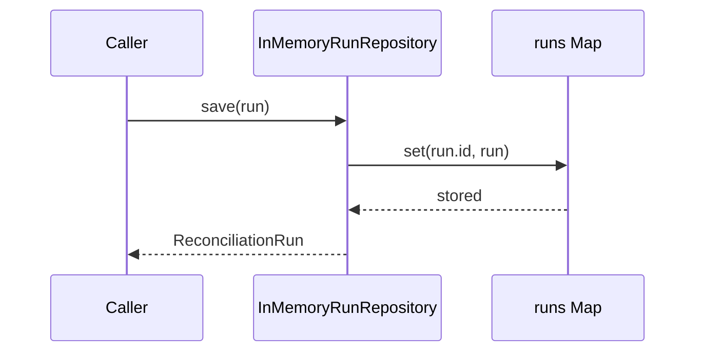
```mermaid
sequenceDiagram
  participant Caller
  participant Repo as InMemoryRunRepository
  participant Runs as runs Map
  Caller->>Repo: save(run)
  Repo->>Runs: set(run.id, run)
  Runs-->>Repo: stored
  Repo-->>Caller: ReconciliationRun
```

### InMemoryRunRepository.findById(id)

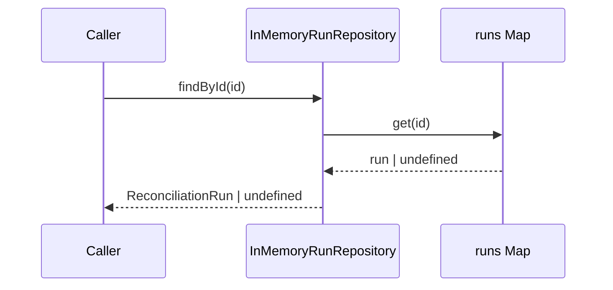
```mermaid
sequenceDiagram
  participant Caller
  participant Repo as InMemoryRunRepository
  participant Runs as runs Map
  Caller->>Repo: findById(id)
  Repo->>Runs: get(id)
  Runs-->>Repo: run | undefined
  Repo-->>Caller: ReconciliationRun | undefined
```

### executeReconciliation(input)

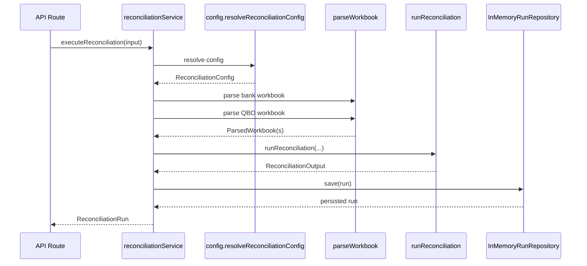
```mermaid
sequenceDiagram
  participant Route as API Route
  participant Service as reconciliationService
  participant Cfg as config.resolveReconciliationConfig
  participant Parser as parseWorkbook
  participant Core as runReconciliation
  participant Repo as InMemoryRunRepository
  Route->>Service: executeReconciliation(input)
  Service->>Cfg: resolve config
  Cfg-->>Service: ReconciliationConfig
  Service->>Parser: parse bank workbook
  Service->>Parser: parse QBO workbook
  Parser-->>Service: ParsedWorkbook(s)
  Service->>Core: runReconciliation(...)
  Core-->>Service: ReconciliationOutput
  Service->>Repo: save(run)
  Repo-->>Service: persisted run
  Service-->>Route: ReconciliationRun
```

### createApp(repository?)

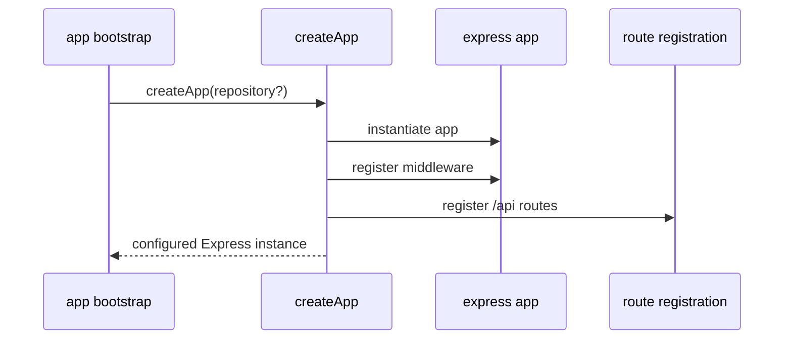
```mermaid
sequenceDiagram
  participant Bootstrap as app bootstrap
  participant Factory as createApp
  participant Express as express app
  participant Routes as route registration
  Bootstrap->>Factory: createApp(repository?)
  Factory->>Express: instantiate app
  Factory->>Express: register middleware
  Factory->>Routes: register /api routes
  Factory-->>Bootstrap: configured Express instance
```

### startServer()

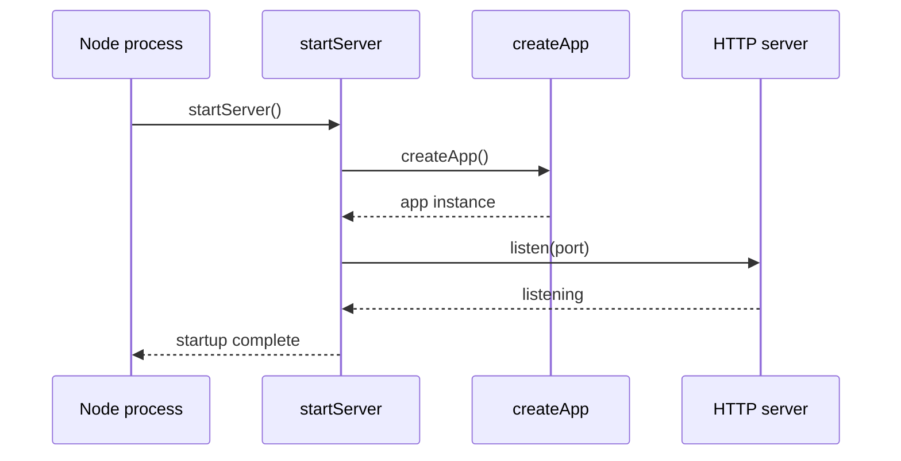
```mermaid
sequenceDiagram
  participant Process as Node process
  participant Server as startServer
  participant App as createApp
  participant Http as HTTP server
  Process->>Server: startServer()
  Server->>App: createApp()
  App-->>Server: app instance
  Server->>Http: listen(port)
  Http-->>Server: listening
  Server-->>Process: startup complete
```

### parseWorkbook(input)

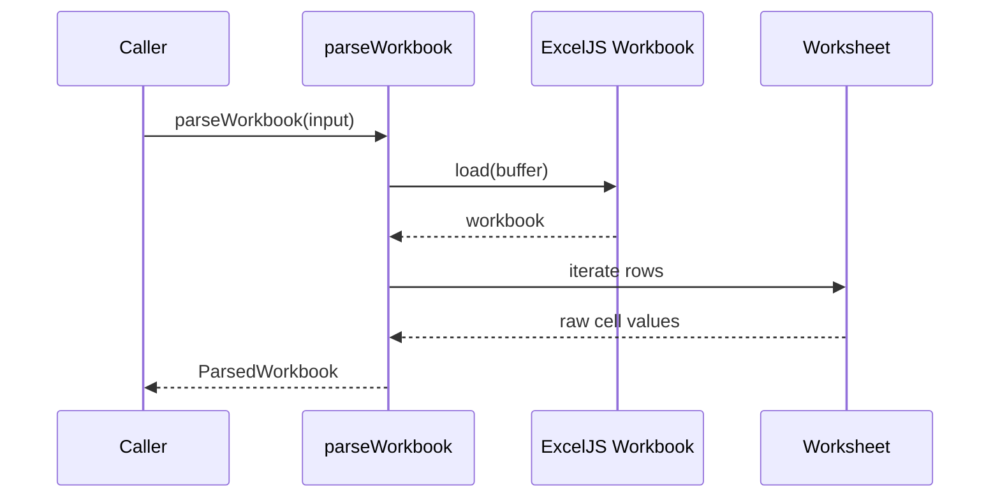
```mermaid
sequenceDiagram
  participant Caller
  participant Parser as parseWorkbook
  participant Excel as ExcelJS Workbook
  participant Sheet as Worksheet
  Caller->>Parser: parseWorkbook(input)
  Parser->>Excel: load(buffer)
  Excel-->>Parser: workbook
  Parser->>Sheet: iterate rows
  Sheet-->>Parser: raw cell values
  Parser-->>Caller: ParsedWorkbook
```

### normalizeText(value, config)

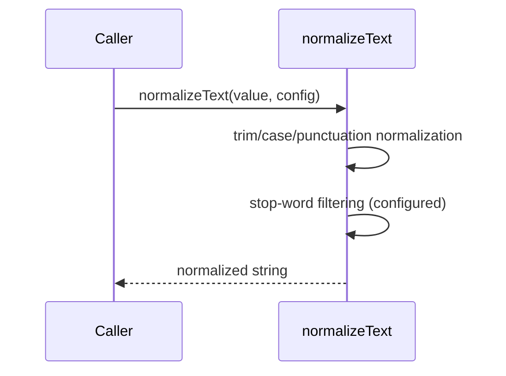
```mermaid
sequenceDiagram
  participant Caller
  participant N as normalizeText
  Caller->>N: normalizeText(value, config)
  N->>N: trim/case/punctuation normalization
  N->>N: stop-word filtering (configured)
  N-->>Caller: normalized string
```

### buildComparisonTokens(values, config)

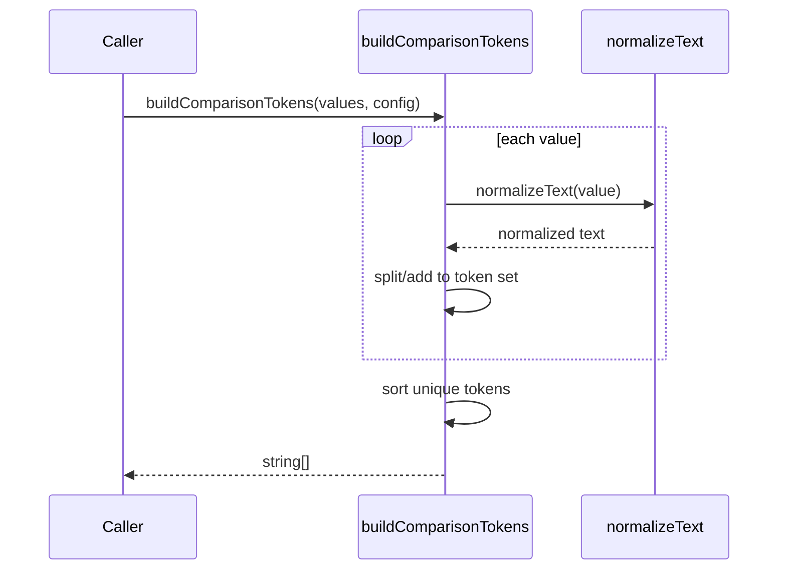
```mermaid
sequenceDiagram
  participant Caller
  participant T as buildComparisonTokens
  participant N as normalizeText
  Caller->>T: buildComparisonTokens(values, config)
  loop each value
    T->>N: normalizeText(value)
    N-->>T: normalized text
    T->>T: split/add to token set
  end
  T->>T: sort unique tokens
  T-->>Caller: string[]
```

### normalizeTransactions(runId, rawRows, config)

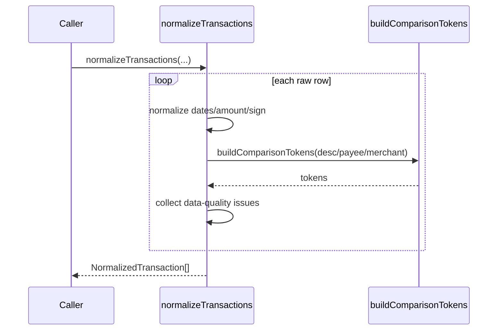
```mermaid
sequenceDiagram
  participant Caller
  participant NT as normalizeTransactions
  participant Txt as buildComparisonTokens
  Caller->>NT: normalizeTransactions(...)
  loop each raw row
    NT->>NT: normalize dates/amount/sign
    NT->>Txt: buildComparisonTokens(desc/payee/merchant)
    Txt-->>NT: tokens
    NT->>NT: collect data-quality issues
  end
  NT-->>Caller: NormalizedTransaction[]
```

### currencyEquals(left, right, tolerance)

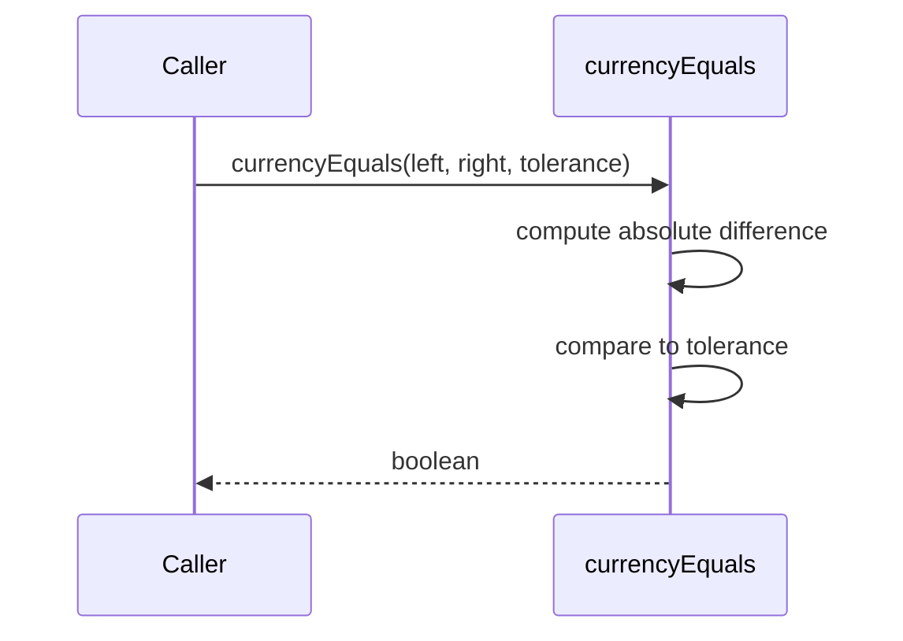
```mermaid
sequenceDiagram
  participant Caller
  participant S as currencyEquals
  Caller->>S: currencyEquals(left, right, tolerance)
  S->>S: compute absolute difference
  S->>S: compare to tolerance
  S-->>Caller: boolean
```

### amountDifference(left, right)

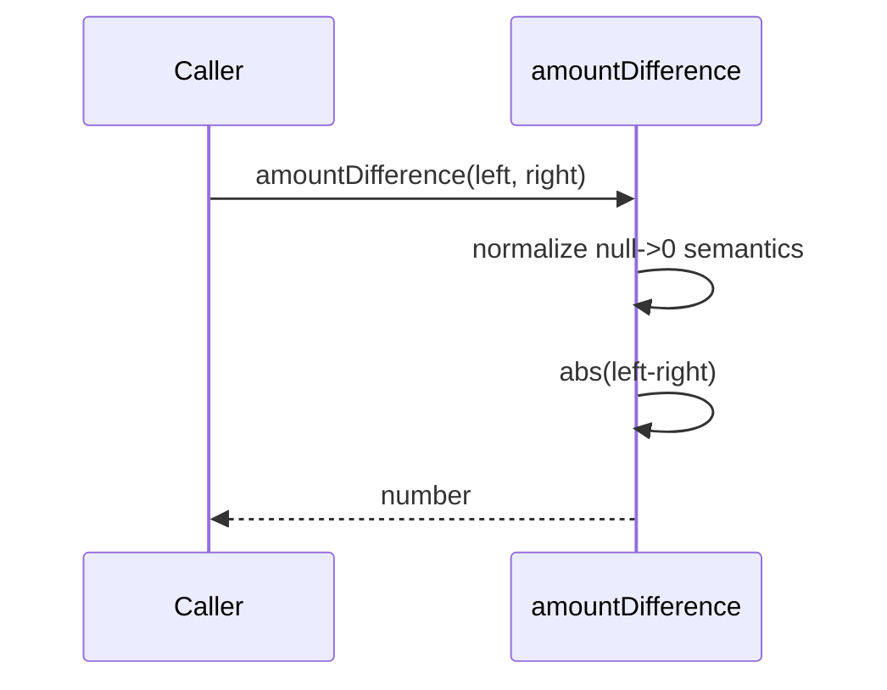
```mermaid
sequenceDiagram
  participant Caller
  participant S as amountDifference
  Caller->>S: amountDifference(left, right)
  S->>S: normalize null->0 semantics
  S->>S: abs(left-right)
  S-->>Caller: number
```

### dateDifferenceDays(left, right)

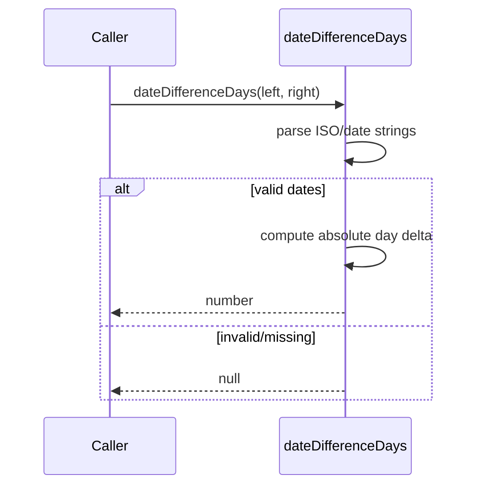
```mermaid
sequenceDiagram
  participant Caller
  participant S as dateDifferenceDays
  Caller->>S: dateDifferenceDays(left, right)
  S->>S: parse ISO/date strings
  alt valid dates
    S->>S: compute absolute day delta
    S-->>Caller: number
  else invalid/missing
    S-->>Caller: null
  end
```

### tokenSimilarity(left, right)

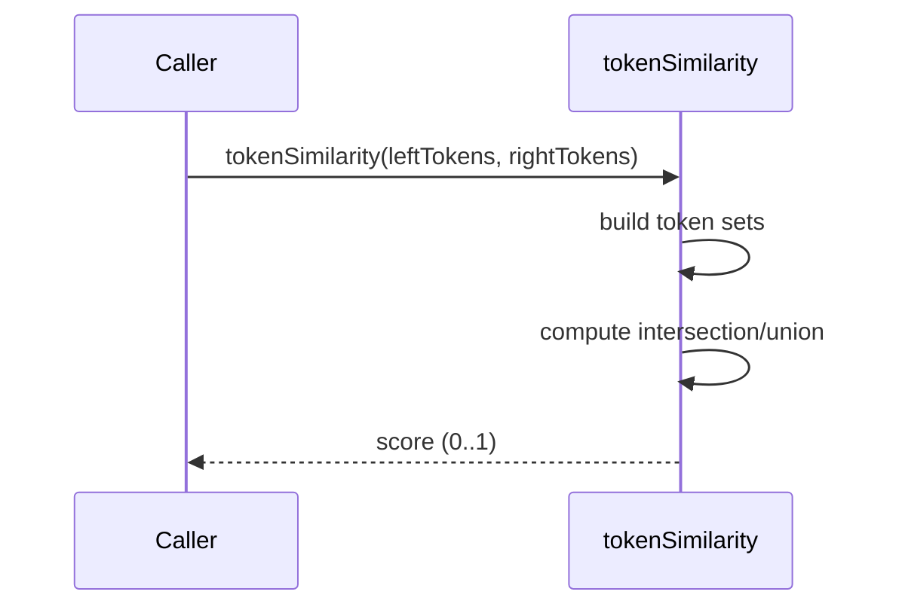
```mermaid
sequenceDiagram
  participant Caller
  participant S as tokenSimilarity
  Caller->>S: tokenSimilarity(leftTokens, rightTokens)
  S->>S: build token sets
  S->>S: compute intersection/union
  S-->>Caller: score (0..1)
```

### reconcileMatches(transactions, config)

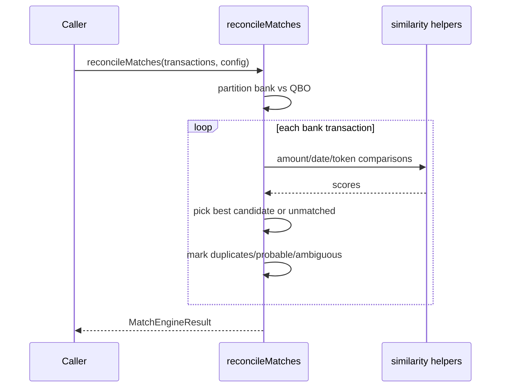
```mermaid
sequenceDiagram
  participant Caller
  participant Engine as reconcileMatches
  participant Similarity as similarity helpers
  Caller->>Engine: reconcileMatches(transactions, config)
  Engine->>Engine: partition bank vs QBO
  loop each bank transaction
    Engine->>Similarity: amount/date/token comparisons
    Similarity-->>Engine: scores
    Engine->>Engine: pick best candidate or unmatched
    Engine->>Engine: mark duplicates/probable/ambiguous
  end
  Engine-->>Caller: MatchEngineResult
```

### classifyExceptions(input)

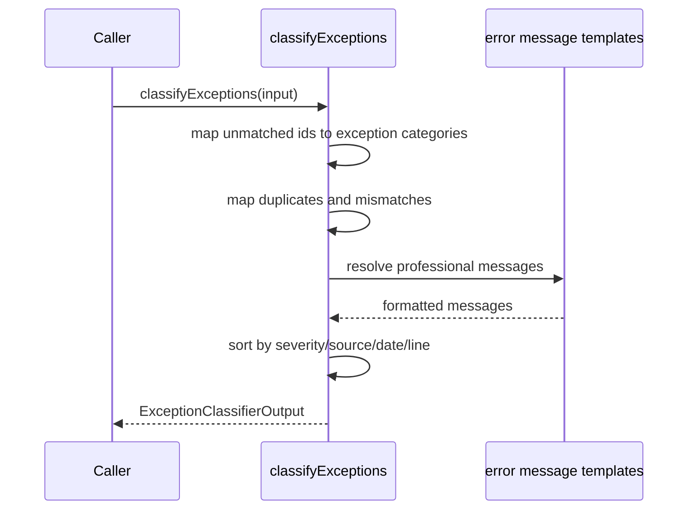
```mermaid
sequenceDiagram
  participant Caller
  participant C as classifyExceptions
  participant Msg as error message templates
  Caller->>C: classifyExceptions(input)
  C->>C: map unmatched ids to exception categories
  C->>C: map duplicates and mismatches
  C->>Msg: resolve professional messages
  Msg-->>C: formatted messages
  C->>C: sort by severity/source/date/line
  C-->>Caller: ExceptionClassifierOutput
```

### buildSummaryMetrics(normalizedTransactions, matchResults, exceptions)

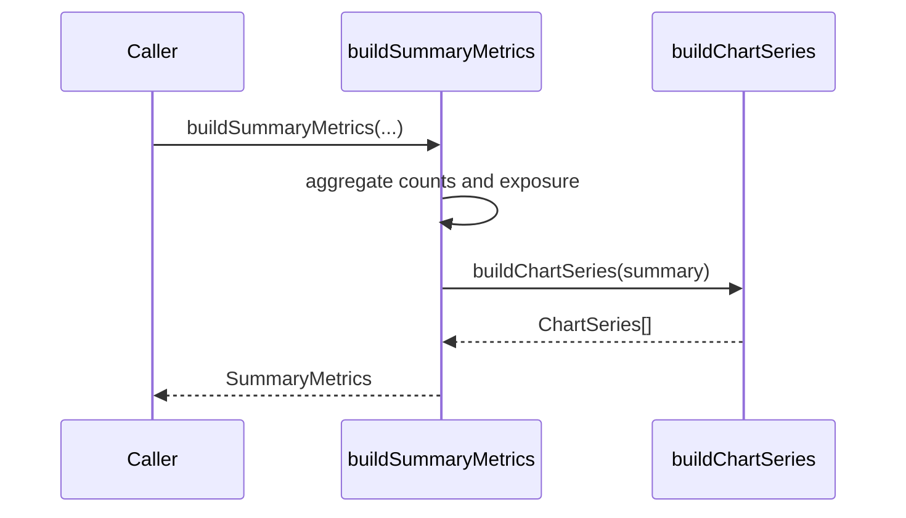
```mermaid
sequenceDiagram
  participant Caller
  participant S as buildSummaryMetrics
  participant Charts as buildChartSeries
  Caller->>S: buildSummaryMetrics(...)
  S->>S: aggregate counts and exposure
  S->>Charts: buildChartSeries(summary)
  Charts-->>S: ChartSeries[]
  S-->>Caller: SummaryMetrics
```

### buildChartSeries(summary)

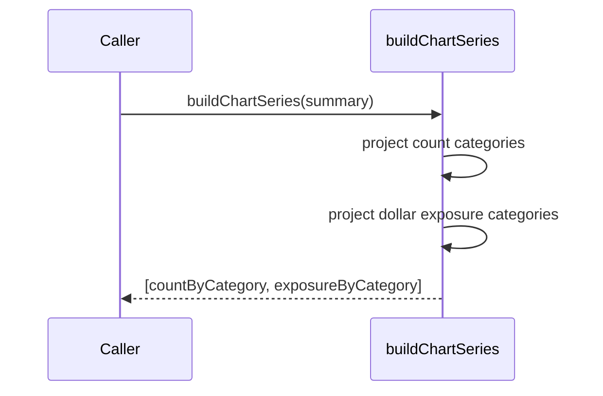
```mermaid
sequenceDiagram
  participant Caller
  participant C as buildChartSeries
  Caller->>C: buildChartSeries(summary)
  C->>C: project count categories
  C->>C: project dollar exposure categories
  C-->>Caller: [countByCategory, exposureByCategory]
```

### exportWorkbook(input)

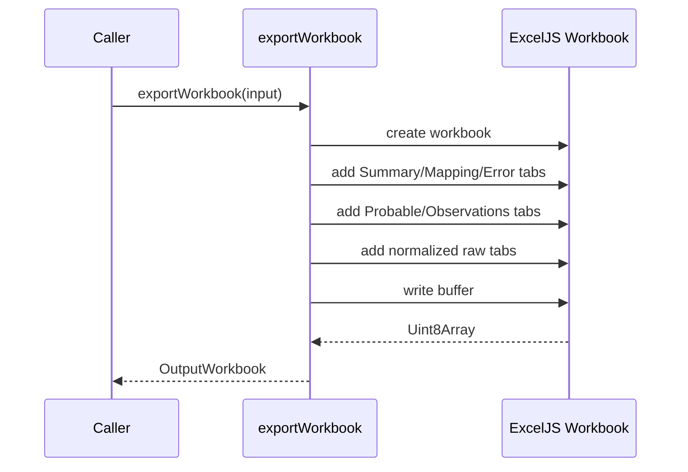
```mermaid
sequenceDiagram
  participant Caller
  participant W as exportWorkbook
  participant Excel as ExcelJS Workbook
  Caller->>W: exportWorkbook(input)
  W->>Excel: create workbook
  W->>Excel: add Summary/Mapping/Error tabs
  W->>Excel: add Probable/Observations tabs
  W->>Excel: add normalized raw tabs
  W->>Excel: write buffer
  Excel-->>W: Uint8Array
  W-->>Caller: OutputWorkbook
```

### runReconciliation(input)

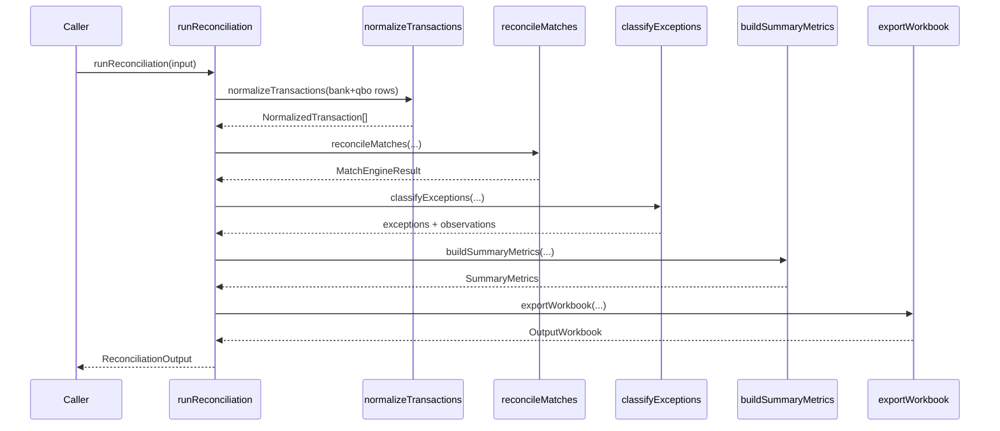
```mermaid
sequenceDiagram
  participant Caller
  participant Run as runReconciliation
  participant Normalize as normalizeTransactions
  participant Match as reconcileMatches
  participant Ex as classifyExceptions
  participant Sum as buildSummaryMetrics
  participant Export as exportWorkbook
  Caller->>Run: runReconciliation(input)
  Run->>Normalize: normalizeTransactions(bank+qbo rows)
  Normalize-->>Run: NormalizedTransaction[]
  Run->>Match: reconcileMatches(...)
  Match-->>Run: MatchEngineResult
  Run->>Ex: classifyExceptions(...)
  Ex-->>Run: exceptions + observations
  Run->>Sum: buildSummaryMetrics(...)
  Sum-->>Run: SummaryMetrics
  Run->>Export: exportWorkbook(...)
  Export-->>Run: OutputWorkbook
  Run-->>Caller: ReconciliationOutput
```

### resolveReconciliationConfig(accountIdentifier?, overrides?)

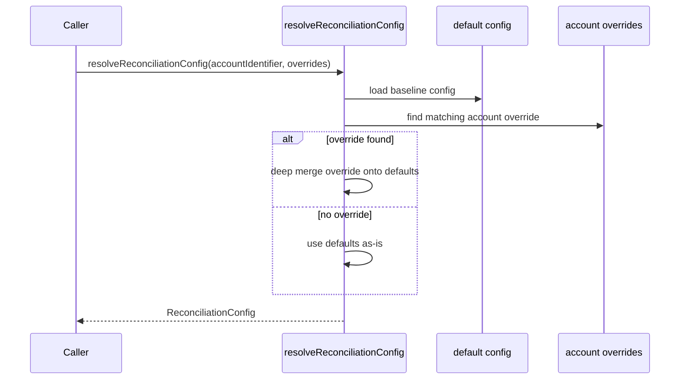
```mermaid
sequenceDiagram
  participant Caller
  participant R as resolveReconciliationConfig
  participant Defaults as default config
  participant Overrides as account overrides
  Caller->>R: resolveReconciliationConfig(accountIdentifier, overrides)
  R->>Defaults: load baseline config
  R->>Overrides: find matching account override
  alt override found
    R->>R: deep merge override onto defaults
  else no override
    R->>R: use defaults as-is
  end
  R-->>Caller: ReconciliationConfig
```

## Notes for Documentation Maintenance

[Back to TOC](#table-of-contents)

- Add new methods to this file whenever a new exported function or class method is introduced in `apps/api` or `packages/core`.
- Keep method state objects behavior-oriented and concise.
- Prefer concrete field names over generic placeholders so accounting and audit reviewers can verify state transitions.